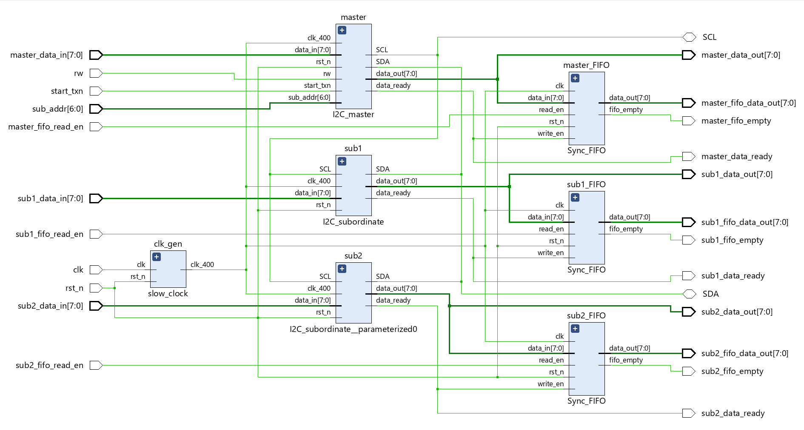
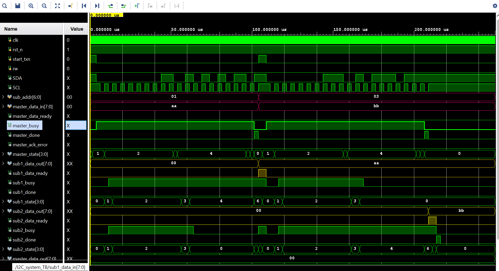
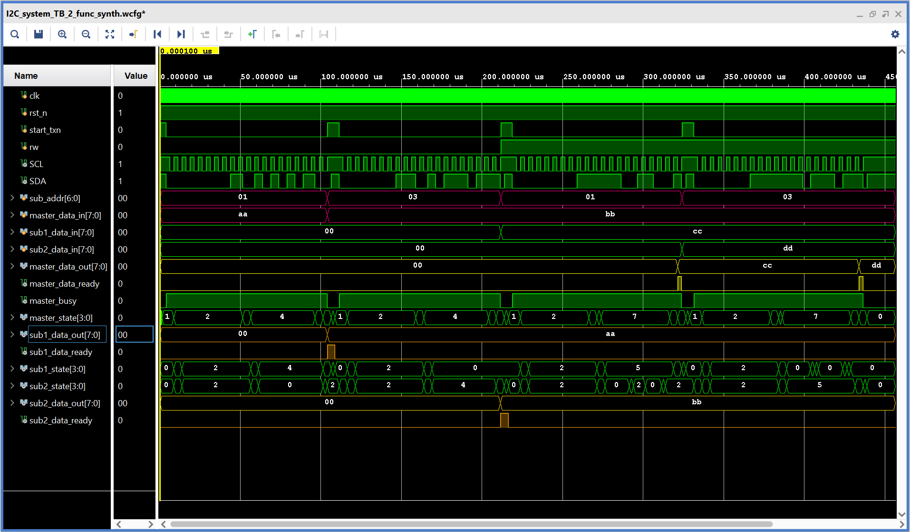
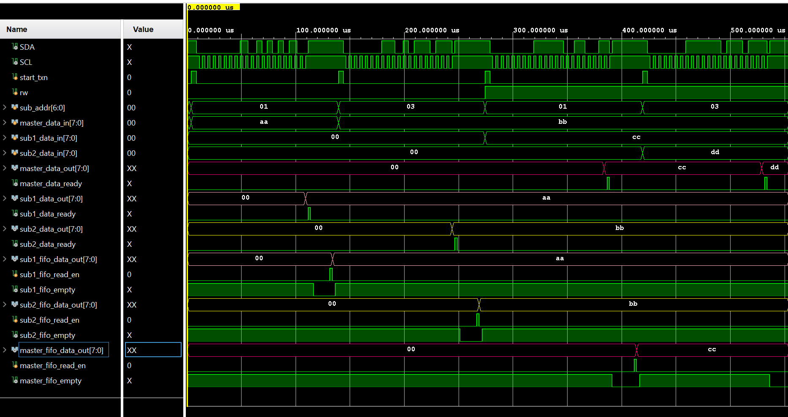

# I2C System with Master and Multiple Subordinates

## Table of Contents
- [Overview](#overview)
- [System Architecture](#system-architecture)
- [Top-Level (`I2C_system`)](#top-level)
- [Clock Generation (`slow_clock`)](#clock-generation)
- [I2C Master (`I2C_master`)](#i2c-master)
- [I2C Subordinate (`I2C_subordinate`)](#i2c-subordinate)
- [FIFO Integration (`Sync_FIFO`)](#fifo-integration)
- [Outputs & Waveforms](#outputs--waveforms)
  - [1. Write Operations (Sub1 & Sub2)](#1-write-operations-sub1--sub2)
  - [2. Write & Read Operations](#2-write--read-operations)
  - [3. Write, Read & FIFO Operations](#3-write-read--fifo-operations)
- [Synthesized Schematic](#synthesized-schematic)
- [Vivado Automation Script](#vivado-automation-script-run_full_flowtcl)
  - [What the script does](#what-the-script-does)
  - [How to run the script](#how-to-run-the-script)
    - [GUI mode (interactive)](#gui-mode-interactive)
    - [Batch mode (automated)](#batch-mode-automated)
- [References](#references)
- [Notes](#notes)

---

## Overview

This project provides the SystemVerilog implementation of a complete **I²C (Inter-Integrated Circuit) system**.  
The top-level module instantiates one I²C Master, two I²C Subordinates (slaves), and a clock generator.

A key feature of this design is the integration of a **Synchronous FIFO** with each I²C device.  
This allows the system to buffer data from transactions, decoupling the I²C protocol timing from the data consumption logic (e.g., a testbench or a processor).

---

## 2. I²C Protocol Overview

### 2.1 Basic Principles
I²C (Inter-Integrated Circuit) is a two-wire, bidirectional serial communication protocol consisting of:
- **SCL (Serial Clock):** Driven by the master device.
- **SDA (Serial Data):** Used for data transfer between master and subordinate.

Both lines are **open-drain** and require pull-up resistors. When idle, both lines remain HIGH.

---

### Start and Stop Conditions

The I²C bus uses specific transitions on the SDA and SCL lines to indicate when communication begins and ends.

**Start Condition (S):**  
A start condition occurs when the SDA line transitions from high to low while the SCL line remains high.  
This signals all devices on the bus that a data transfer is about to begin, and the bus becomes busy.

**Stop Condition (P):**  
A stop condition occurs when the SDA line transitions from low to high while the SCL line remains high.  
This indicates that the current transaction has ended and releases the bus for other devices to use.

---

### 2.3 Data Validity and Timing
- Data on **SDA** must remain **stable while SCL is HIGH**.
- Any change in SDA during SCL HIGH is interpreted as a start or stop condition.
- Data changes are only allowed when **SCL is LOW**.
- Data is transmitted **MSB first**.
- The receiver samples SDA **on the rising edge** of SCL.

---

### 2.4 Acknowledgement (ACK/NACK)
After every 8 data bits, the transmitter releases SDA, and the receiver pulls it LOW to acknowledge reception.

- **ACK:** SDA = LOW  
- **NACK:** SDA = HIGH 

---

### 2.5 Addressing and R/W Bit
Each transaction begins with the master transmitting a **7-bit address** followed by one R/W bit:
- **R/W = 0:** Write operation (Master writes to subordinate)
- **R/W = 1:** Read operation (Master reads from subordinate)

The subordinate compares the address on the bus to its own and responds with an ACK if matched.

---

## 3. Design Schematic

---

## 4. Detailed Design Description

### 4.1 Synchronization Mechanism
Both Master and Subordinate modules implement **two-stage synchronizers** for the asynchronous SDA and SCL lines.  
This ensures both FSMs interpret transitions consistently, avoiding metastability and timing mismatches.

All transitions are edge-aligned with the internally generated 400 kHz SCL.

The subordinate also operates using synchronized SCL/SDA signals, ensuring precise timing alignment with the master.

---

### 4.2 Timing and Clock Generation
The `slow_clock` module divides the FPGA system clock to produce a 400 kHz signal used as the reference for SCL.  
Both master and subordinate FSMs derive their internal transitions from this reference, ensuring deterministic timing.

---

## System Architecture

The system consists of:
- One **I2C Master** controlling the shared SDA/SCL bus.
- Two **I2C Subordinates**, each with a unique address.
- Three **Synchronous FIFOs** for buffering transmitted and received data.
- A **Clock Divider** that generates a 400 kHz I2C clock from the main system clock.

---

## Top-Level (`I2C_system`)

The `I2C_system` module is the main wrapper that connects all components. It:

- Generates a 400 kHz clock (`clk_400`) from the main system `clk`.
- Instantiates one `I2C_master`.
- Instantiates two `I2C_subordinate` modules (`sub1` and `sub2`) with unique addresses:
  - `sub1`: `7'b0000001`
  - `sub2`: `7'b0000011`
- Instantiates three `Sync_FIFO` modules, one for each I2C device.
- Manages the top-level I/O for controlling the master and accessing the FIFO data.

---

### Clock Generation (`slow_clock`)

This module takes the high-speed system `clk` and generates the slower `clk_400` required for the I2C modules and the synchronous FIFOs to operate.

---

### I2C Master (`I2C_master`)

The `I2C_master` module initiates and controls all communication on the I2C bus.  
It generates the `SCL` clock and manages the `SDA` line according to the protocol rules.

Its operation is governed by a Finite State Machine (FSM) that manages the full lifecycle of a transaction:

- **IDLE:** Waits for the `start_txn` signal.  
- **START:** Generates the I2C START condition.  
- **SEND_ADDR:** Shifts out the 7-bit slave address and the `rw` bit.  
- **WAIT_ACK_ADDR:** Waits for the subordinate to ACK.  
- **SEND_DATA:** (On Write) Shifts out the 8-bit byte from `data_in`.  
- **WAIT_ACK_DATA:** (On Write) Waits for the subordinate to ACK the data byte.  
- **PRE_RECEIVE:** (On Read) A state to synchronize FSMs before data reception.  
- **RECEIVE_DATA:** (On Read) Samples the SDA line to receive 8 bits of data.  
- **MASTER_ACK:** (On Read) Sends a NACK (SDA high) to signal the end of a single-byte read.  
- **DATA_VALID:** (On Read) Loads the received data into the `data_out` register.  
- **PULSE_READY:** (On Read) Generates a one-cycle `data_ready` pulse.  
- **STOP:** Generates the I2C STOP condition and returns to IDLE.

---

### I2C Subordinate (`I2C_subordinate`)

The `I2C_subordinate` module acts as a slave device on the bus, responding only when addressed by the master.  
It uses a **2-stage synchronizer** for `SCL` and `SDA` to safely detect protocol conditions in its local clock domain (`clk_400`).

FSM states include:

- **IDLE:** Waits for a START condition.  
- **START:** Detects the START and prepares to receive the address.  
- **ADDR_RX:** Samples SDA to receive the 8-bit address/rw byte.  
- **ADDR_ACK:** Checks if the received address matches its `my_addr` parameter. If it matches, drives SDA low to ACK.  
- **RECEIVE_DATA:** (On Master Write) Receives the 8-bit data byte.  
- **DATA_VALID:** (On Master Write) Latches the received byte into the `data_out` register.  
- **SEND_DATA_ACK:** (On Master Write) Drives SDA low to ACK the data byte and pulses `data_ready` high.  
- **SEND_DATA:** (On Master Read) Places its data from `data_in` onto the SDA line.  
- **WAIT_MASTER_ACK:** (On Master Read) Monitors for the master's ACK or NACK.  
- **STOP:** Detects the STOP condition and returns to IDLE.

---

### FIFO Integration (`Sync_FIFO`)

Three synchronous FIFOs are used to buffer data from completed I2C transactions.  
All FIFOs are clocked by `clk_400`.

#### Master FIFO (`master_FIFO`)
- **Purpose:** Stores data read by the master from a subordinate.  
- **Write Logic:** `master_data_ready` (one-cycle pulse) connects to FIFO’s `write_en`; `master_data_out` connects to FIFO’s `data_in`.  
- **Read Logic:** The testbench can pop data using `master_fifo_read_en`.

#### Subordinate FIFOs (`sub1_FIFO`, `sub2_FIFO`)
- **Purpose:** Store data written to the subordinates by the master.  
- **Write Logic:** `subX_data_ready` (one-cycle pulse) connects to FIFO’s `write_en`; `subX_data_out` connects to FIFO’s `data_in`.  
- **Read Logic:** The testbench can pop data using `subX_fifo_read_en`.

---

## Outputs & Waveforms

### 1. Write Operations (Sub1 & Sub2)

  
Demonstrates the master performing consecutive write operations to both subordinates (`sub1` and `sub2`), verifying correct addressing, data transfer, and ACK responses.

---

### 2. Write & Read Operations
  
Shows a mixed sequence (e.g., master write to `sub1`, followed by master read from `sub2`), confirming proper handling of both `rw=0` and `rw=1` transactions.

---

### 3. Write, Read & FIFO Operations
  
Demonstrates full data flow:
- **Master Write:** Master writes data to `sub1`.  
- **Subordinate FIFO:** `sub1_data_ready` pulses, pushing the data into `sub1_FIFO`.  
- **Master Read:** Master reads data from `sub2`.  
- **Master FIFO:** `master_data_ready` pulses, pushing the data into `master_FIFO`.  
- **FIFO Read:** The testbench asserts `sub1_fifo_read_en` and `master_fifo_read_en` to pop and verify data.

---

## Vivado Automation Script

### What the script does
- Creates a new Vivado project named `I2C_Protocol` for `xc7z020clg484-1`
- Adds source files (design SV files and testbench).
- Runs synthesis (`synth_1`) and waits for completion.
- Captures the post-synthesis utilization report (`post_synth_utilization.rpt`).
- Prints DSPs, LUTs and FFs used.
- Launches a post-synthesis functional simulation (XSIM).
- Prints the utilization summary to the Tcl console.
- Behavior:
  - GUI mode: leaves project and windows open for inspection.
  - Batch mode: closes project and exits Vivado on completion.

### How to run the script

#### Prerequisites
- Put `run_full_flow.tcl` and all source files (`*.sv`, `*.v`) in the same directory.

#### GUI mode (interactive)
1. Open Vivado GUI.
2. In the Tcl Console, change to project directory where all the files are stored. 
3. Run: 'source run_full_flow.tcl'
4. if running from terminal, navigate to where the project files are stored.
5. Run: 'vivado -mode batch -source run_full_flow.tcl'

## References

1. [I2C Protocol Tutorial - YouTube (Video 1)](https://www.youtube.com/watch?v=jFtr0Ha5f-c&t=23s)  
2. [I2C Protocol Explanation - YouTube (Video 2)](https://www.youtube.com/watch?v=CAvawEcxoPU)  
3. [NXP I2C-Bus Specification and User Manual (UM10204)](https://www.nxp.com/docs/en/user-guide/UM10204.pdf)  
4. [FIFO Repository](https://github.com/gokaran-dev/FIFO)

---

## Notes

- The I²C protocol is currently **verified for single-byte transactions** only.  
- Multi-byte transaction support and burst read/write functionality will be implemented and verified in future updates.

---
